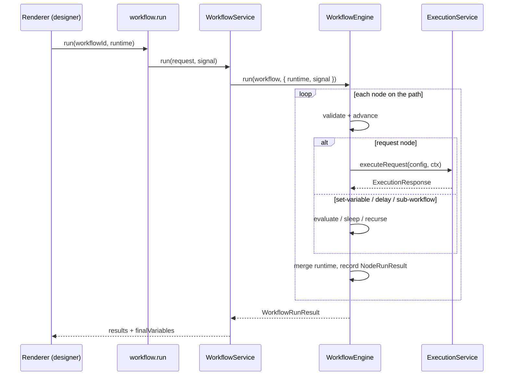
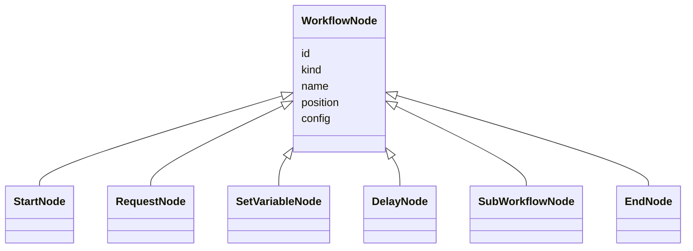

# Workflows — Architecture

Phase 12 delivers the workflow engine: the domain model for workflows, their persistence, and a deterministic headless runtime. It builds directly on the execution engine (Phase 10) and the variable engine (Phase 8), and is consumed by the React Flow designer in the renderer.

## Design principles

The governing decision is [ADR-0005](../../../../../docs/adr/0005-workflow-engine-design.md): the workflow **domain graph is framework-independent** and is the single source of truth. React Flow is only an editing/rendering surface and carries no execution semantics. The runtime therefore runs entirely in the main process, is headless, and is unit-testable without any UI, HTTP, database, or wall-clock dependency — everything side-effecting is injected as a port.

The second decision, [ADR-0008](../../../../../docs/adr/0008-workflow-execution-context.md), defines how data flows between steps: a single mutable **runtime variable map** threaded through the run. `set-variable` nodes write to it, `sub-workflow` results merge into it, and every node (including request nodes via their variable context) reads from it. There is no per-node response-mapping language yet — that is Phase 15.

## Layers

```
WorkflowService (application)        CRUD over persistence + run orchestration
        │ composes
        ▼
WorkflowEngine (domain runtime)      deterministic linear walk; injected ports
        │ uses
        ▼
workflow-graph (pure)                validation + traversal of the graph
```

`WorkflowService` is the only part that knows about persistence; `WorkflowEngine` and `workflow-graph` are pure given their inputs and ports.

## Execution model

`validateGraph` enforces the invariants the linear runtime relies on: exactly one `start`, every edge references an existing node, no node has more than one outgoing edge (no branching until Phase 14), and the path from start is acyclic. The engine then begins at the start node and follows each node's single outgoing edge, executing one node at a time:

1. Read the node's configuration.
2. Perform its effect through an injected port (`executeRequest` for request nodes, `evaluate` for `set-variable`, `sleep` for `delay`, `loadWorkflow` for `sub-workflow`).
3. Merge any variables the node produced into the shared runtime map.
4. Record a `NodeRunResult` (status, duration, message, optional response/variables).
5. Stop on failure; otherwise advance to the successor.

A node failure stops the run with status `failed`; an aborted signal yields `cancelled`. Sub-workflows execute into the same result list and runtime map, guarded by a stack of running workflow ids (cycle detection) and a depth limit.

### Determinism

Determinism is the acceptance criterion. The engine has no hidden state, no randomness, and reads time only through the injectable `now` clock, so identical inputs (graph + seed runtime + deterministic ports) produce identical ordered results. The unit tests assert this by running the same workflow twice and comparing the whole result.

## Diagrams

### Run sequence



### Node kinds



## Files

- `workflow-service.ts` — CRUD + run orchestration; maps rows to DTOs.
- `workflow-engine.ts` — the deterministic runtime and its ports.
- `workflow-graph.ts` — pure validation and traversal helpers.
- `errors.ts` — `WorkflowError`.
- `index.ts` — public surface.
- `__tests__/` — engine determinism/propagation/sub-workflow/failure/cancellation, graph validation, and service CRUD + run.

## Boundaries and future phases

The visual designer's full canvas interactions — undo/redo, clipboard, and grouping — were delivered in **Phase 13** (grouping persists as view-only `groups` metadata the runtime ignores); control flow — conditions, switch, loops, retry/timeout/error policy, and cancellation with in-memory pause/resume — landed in **Phase 14** (the walker now selects the next node from the branch a node chooses, and runs under a per-node `NodePolicy` and a `RunController`); visual data mapping (JSONPath/JMESPath/regex) is **Phase 15**. The domain model here is the stable target those phases extend, and the plugin SDK (Phase 16) will register custom node kinds against it without changing the runtime's shape.
