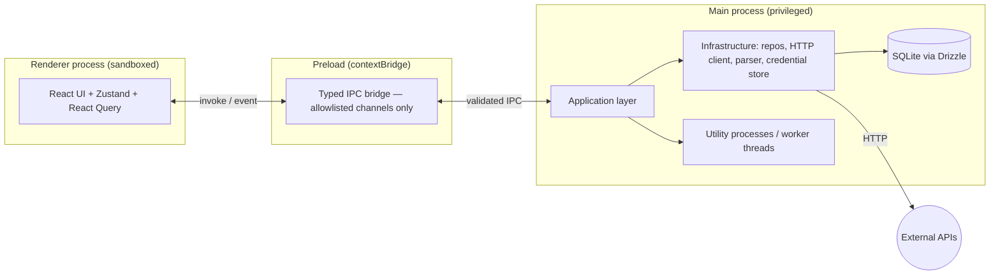

# Architecture Overview

This document defines the target architecture for API Workbench. It is the authoritative reference that each implementation phase must conform to. Where a phase needs to deviate, the deviation must be captured as an [ADR](../adr/).

## Goals and constraints

The architecture is shaped by a few non-negotiable goals: a local-first product with no mandatory cloud dependency; a security posture appropriate for a desktop app that executes arbitrary user-defined HTTP requests and stores secrets; an extensible core that third parties can plug into without forking; and performance characteristics that hold up at 100,000+ requests in a collection. These goals drive the layering, the process model, and the persistence design described below.

Architecturally the project is a modular monorepo organised around clean-architecture layers with feature-based modules. Dependencies point inward only: outer layers may depend on inner layers, never the reverse. There are no circular dependencies between packages, and this is enforced in CI.

## Layering

API Workbench separates five concerns, each owning a distinct responsibility and each mapped to one or more packages in the monorepo.

The **Domain** layer holds the enterprise model — entities, value objects, domain events, and the invariants that define what a Collection, Request, Environment, Variable, Workflow, or Version *is*. It has no dependency on any framework, on Electron, on the database, or on the network. It is pure TypeScript and is the most stable, most reused part of the system.

The **Application** layer orchestrates use cases. It contains the services, command/query handlers, and ports (interfaces) that express what the system *does* — "import an OpenAPI document", "execute a request", "run a workflow", "create a version snapshot". It depends on the Domain layer and on abstract ports, never on concrete infrastructure. Dependency injection supplies the concrete implementations at composition time.

The **Infrastructure** layer implements the ports the Application layer declares: the SQLite/Drizzle repositories, the HTTP execution client, the OpenAPI parser, the credential store, the file-system access, and the IPC adapters. This is where framework- and platform-specific code lives, and it is the layer most likely to change for reasons unrelated to business rules.

The **UI** (Presentation) layer is the React renderer application. It depends on the Application layer through the IPC contract and React Query, and it never reaches directly into Infrastructure or the database. State is local and ephemeral in the renderer; the source of truth is the main process and SQLite.

The **Shared** layer is a thin set of cross-cutting utilities, types, constants, and the IPC contract definitions consumed by both processes. It has no dependency on the other layers and exists to prevent duplication and to give both processes a single typed definition of the wire format.

```
UI ─────────────┐
                ▼
          Application ───► Domain
                ▲              ▲
                │              │
        Infrastructure ───────┘
                ▲
                │
             Shared  (depended on by all, depends on none)
```

The direction of the arrows is the dependency direction. The UI talks to the Application layer; the Application layer defines ports that Infrastructure implements; both Application and Infrastructure build on the Domain; Shared underpins everything without depending on anything.

## Electron process model

Electron splits the app into a privileged **main process** and one or more sandboxed **renderer processes**. API Workbench treats this split as a security boundary, not merely a runtime detail.

The main process is the only place with access to Node.js, the file system, the SQLite database, the network stack used for request execution, and the OS credential store. It hosts the Application and Infrastructure layers. The renderer process runs the React UI with `contextIsolation` enabled, `nodeIntegration` disabled, and a `sandbox`. The renderer has no direct access to Node or the database; it can only invoke a fixed, explicitly enumerated set of IPC channels exposed through a `contextBridge` preload script.

Heavy or long-running work — executing a large workflow, importing a large OpenAPI spec, diffing big collections — is delegated to **utility processes / worker threads** spawned from the main process so the UI thread and the main event loop stay responsive. This is how the platform meets its responsiveness targets at scale (see [Phase 17](../ROADMAP.md)).



## IPC contract

All cross-process communication uses a single typed contract defined in the Shared layer. Every channel has a name, a Zod schema for its request payload, and a Zod schema for its response. The preload bridge exposes only the enumerated channels; there is no generic "invoke arbitrary method" escape hatch. On the main side, every incoming message is validated against its schema before any handler runs, and validation failures are rejected and logged rather than processed. This gives us end-to-end type safety from React call site to handler, and a hard boundary that untrusted renderer input cannot cross without passing schema validation. The rationale is recorded in [ADR-0003](../adr/0003-electron-security-and-ipc.md).

## Data flow — a representative request

A typical "send request" interaction illustrates how the layers cooperate. The user edits a request in the Monaco-backed editor; the UI holds that draft in local React state. On send, the renderer invokes the `request.execute` IPC channel with the request definition. The preload bridge forwards it; the main process validates the payload, resolves variables through the variable engine (applying scope precedence and decrypting any secrets in-memory only), applies the configured authentication, and dispatches the call through the HTTP execution client with the configured timeout, retry, and redirect policy. Streaming responses are chunked back over an event channel; the final response — headers, body, timing metrics — is persisted to history and returned. The renderer renders it through the response viewer and React Query caches it. At no point does the renderer touch the database, the file system, or the raw network.

## Cross-cutting concerns

**Dependency injection.** A lightweight DI container in the main process wires ports to implementations at startup. Modules declare what they need as constructor dependencies; nothing news-up its own infrastructure. This keeps the Application layer testable with fakes and keeps wiring in one place.

**Error handling.** Domain and Application code raise typed, domain-specific errors. Infrastructure translates platform exceptions (network, SQLite, file system) into those typed errors at the boundary. The IPC layer serialises errors into a structured shape the renderer can render. The renderer wraps its tree in an error boundary so a UI fault degrades gracefully rather than blanking the window.

**Logging and telemetry.** A structured logger (JSON lines) runs in the main process with redaction of secret values. Renderer logs are forwarded over IPC so there is a single, correlated log stream. Telemetry is local-first and opt-in.

**Configuration and preferences.** User preferences and workspace settings are persisted in SQLite (see [Phase 2](../ROADMAP.md)) and exposed to the renderer through the same IPC contract, never through direct file reads from the renderer.

**Security of secrets.** Secret variables and credentials are encrypted at rest using the OS keychain-derived key (Electron `safeStorage`), decrypted only in the main process and only for the duration of a request, and never logged or sent to the renderer in plaintext. See [ADR-0006](../adr/0006-secret-and-credential-storage.md).

## Module communication

Within a process, feature modules communicate through the Application layer's use cases and through a domain event bus for decoupled reactions (for example, "collection imported" triggering an automatic version snapshot). Modules never import each other's internal infrastructure; they depend on Domain types and Application ports. This is what allows a feature to be developed, tested, and reasoned about in isolation, and what keeps the dependency graph acyclic.

## Extensibility

The plugin SDK (Phase 16) exposes a stable extension API surface: plugins register custom workflow nodes, request types, authentication providers, and importers against four runtime registries seeded with the built-ins. The public contract is the semantically versioned `@api-workbench/plugin-sdk` package ([ADR-0007](../adr/0007-plugin-sdk-boundary.md)); the validation authority is the shared Zod manifest schema. Request types are possible because execution is protocol-agnostic — a request envelope dispatched to per-type providers, HTTP being built-in provider #1 ([ADR-0009](../adr/0009-protocol-abstraction.md)). Plugin code runs only in an isolated utility process behind a Zod-validated RPC bridge with per-call capability enforcement ([ADR-0010](../adr/0010-plugin-host-process.md)); the renderer consumes only declarative contribution metadata (labels, icons, form schemas) and renders plugin config UIs with a generic schema-driven form — no third-party code in the UI or main process.

## Testing strategy

The layering is what makes the testing targets achievable. Domain logic is unit-tested in pure isolation. Application use cases are tested against in-memory fakes of their ports. Infrastructure adapters get integration tests against real SQLite and a mock HTTP server. The renderer is tested with React Testing Library, and full flows are exercised end-to-end with Playwright driving the packaged Electron app. The >90% coverage gate is enforced in CI. See the [Roadmap](../ROADMAP.md) for per-phase acceptance criteria.
