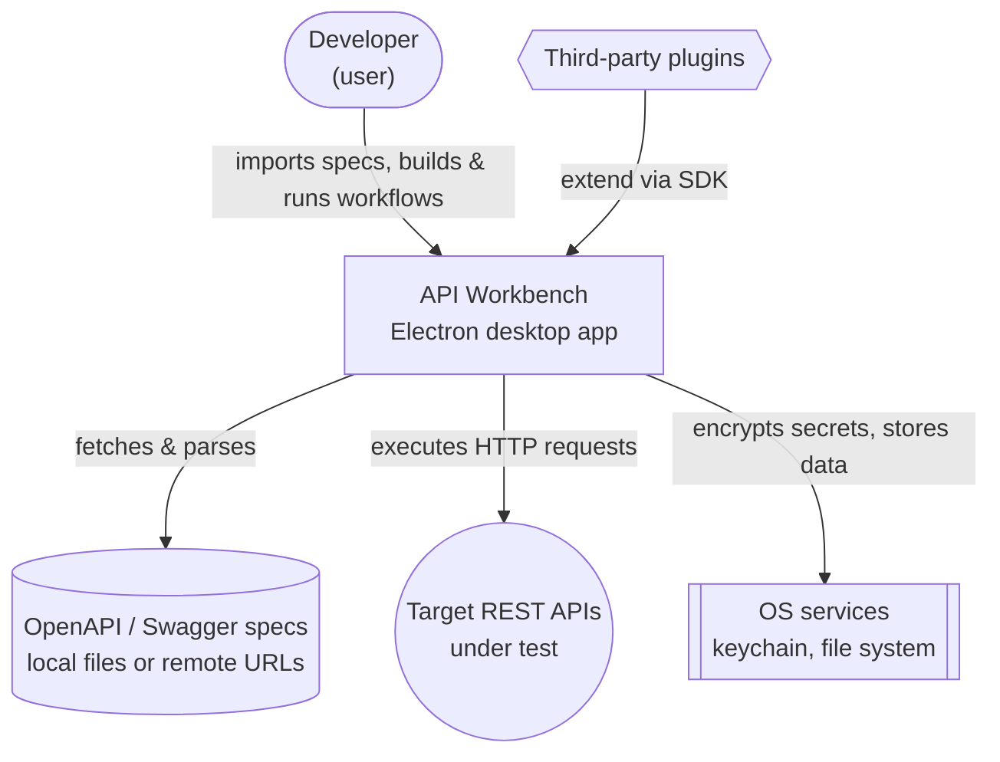
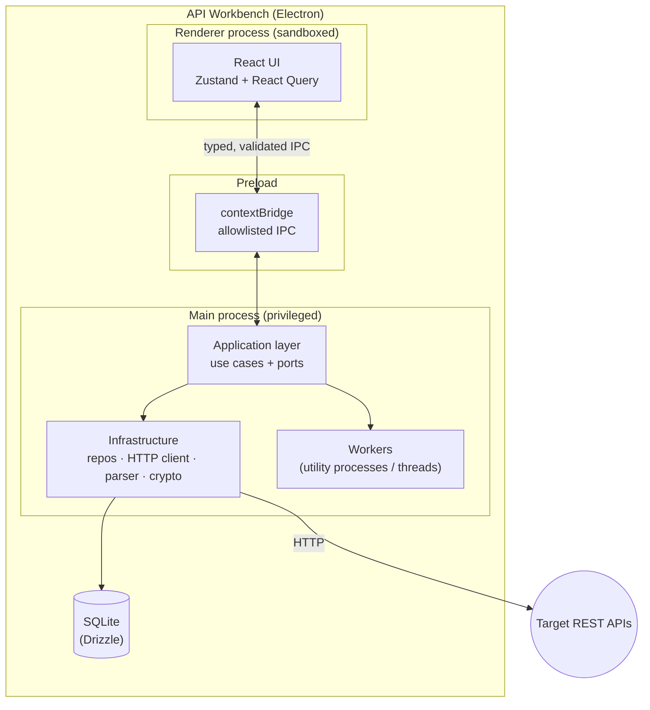
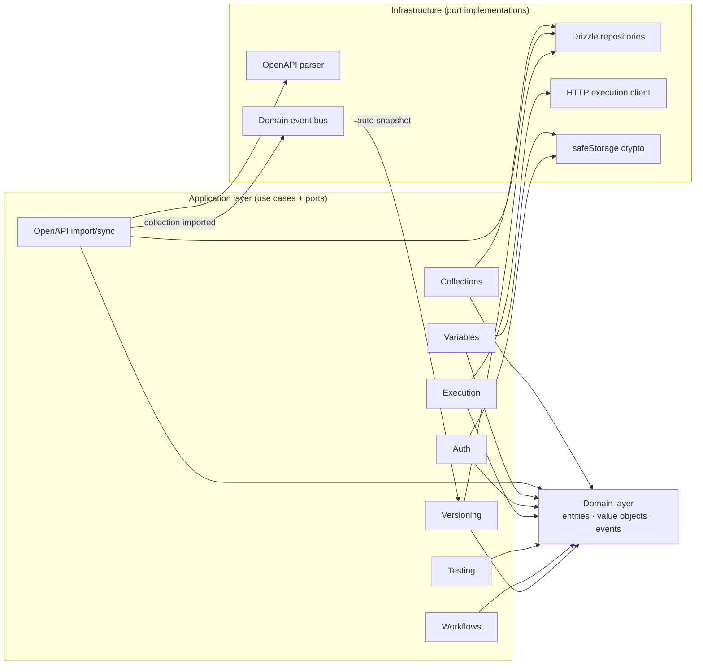
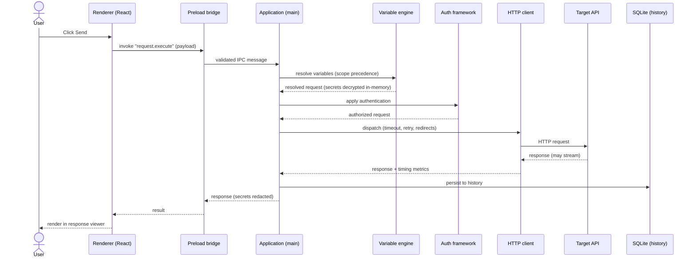
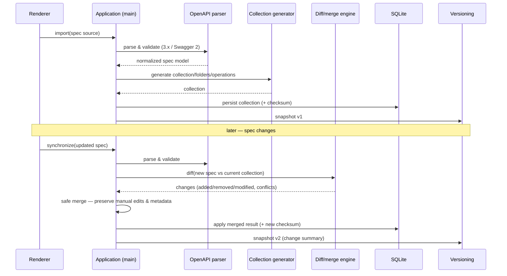
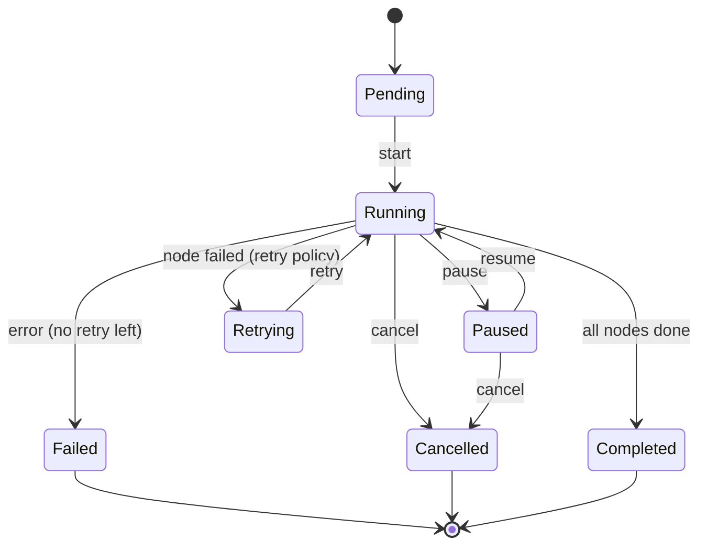
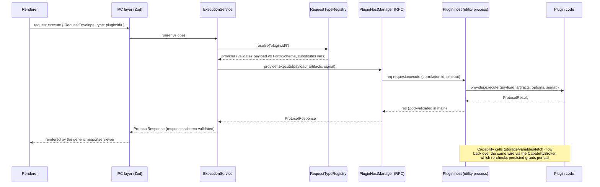

# Diagrams

This document collects the system's structural and behavioural diagrams, authored in Mermaid so they render in most Markdown viewers and stay versioned alongside the code. They follow the C4 model (context → container → component) and add sequence and flow diagrams for the most important runtime behaviours. Diagrams here describe the target architecture defined in the [Architecture Overview](./ARCHITECTURE.md).

## C4 Level 1 — System context

Who and what API Workbench interacts with.

## C4 Level 2 — Containers

The runtime pieces inside the application and how they communicate. The renderer is sandboxed; everything privileged lives in the main process.

## C4 Level 3 — Components (main process)

The application and infrastructure layers decomposed into the feature modules from the [Folder Structure](./FOLDER_STRUCTURE.md).

## Sequence — Execute a request

How a send flows from the editor through the boundary to an external API and back, with variables resolved and secrets handled only in the main process.

## Sequence — Import then synchronize an OpenAPI spec

How import generates a collection and how a later sync preserves manual edits.

## State — Workflow runtime

The execution states a workflow run moves through, supporting pause, resume, retry, and cancellation.

## Sequence — Plugin contribution execution (Phase 16)

How a plugin-contributed request type executes: the envelope dispatches through the registry to an RPC-backed provider running in the isolated plugin host (ADR-0009/0010). Node executors, auth providers, and importers follow the same shape.

## Maintaining these diagrams

When a structural change is made, update the affected diagram in the same change set, and if the change reflects a decision, record it as an [ADR](../adr/). Module-specific diagrams live in that module's `Architecture.md`; this file holds system-wide views.
