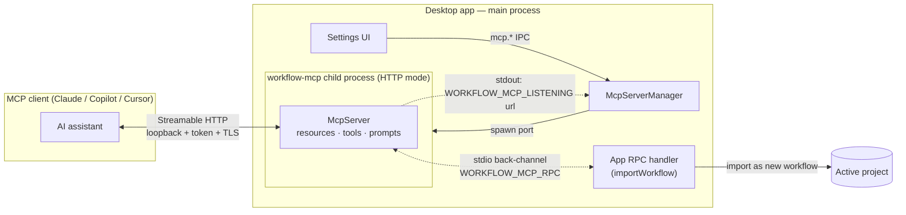

# MCP Server Architecture

API Workbench ships a **Model Context Protocol (MCP)** server so AI coding assistants — Claude, Copilot, Cursor, and any other MCP client — can author API Workbench workflows with the real schema in hand, validate them, and hand a finished workflow straight back into the open project. This document is the authoritative reference for how that server is built, spawned, secured, and wired into the app. The decision rationale lives in [ADR-0011](../adr/0011-app-managed-mcp-server.md); this document describes the resulting system.

> **What MCP gives us.** MCP is a client/server protocol where a server exposes three primitives: **resources** (read-only context the client can pull), **tools** (actions the model can invoke), and **prompts** (templates the user can invoke). API Workbench's server exposes the workflow schema and examples as resources, schema-validation and workflow-generation as tools, and a "create workflow from description" prompt.

## Two halves, one artifact

The implementation is split into two cooperating parts that know nothing about each other's internals:

| | Package | App integration |
| --- | --- | --- |
| **Path** | `packages/workflow-mcp/` | `apps/desktop/src/main/mcp/` |
| **Name** | `@api-workbench/workflow-mcp` | (part of `@api-workbench/desktop`) |
| **Knows about** | MCP protocol, workflow schema, transports | Electron, child-process lifecycle, IPC, app state |
| **Depends on the app?** | No — runs standalone via `npx` | Yes — it *is* the app |
| **Depends on MCP wire details?** | Yes | No — treats the child as an opaque process |

This separation is the core design choice: the package is a self-contained MCP server that also works with no app running (stdio mode), and the app is a supervisor that spawns and manages it (Streamable HTTP mode) without reaching into protocol details. See [ADR-0011](../adr/0011-app-managed-mcp-server.md).



## The package: `@api-workbench/workflow-mcp`

An ESM Node package (`type: module`, `engines.node >= 20`) built with the official `@modelcontextprotocol/sdk`. `tsc` compiles `src/` to `dist/`, and a `copy-assets` step copies the generated schema and examples into `dist/`. The `bin` entry `workflow-mcp` points at `dist/index.js`.

### Entrypoint and transports (`src/index.ts`)

One entrypoint, two transports, chosen by CLI flag:

- **stdio (default).** The client spawns the process and speaks JSON-RPC over stdout. Because stdout *is* the protocol channel, **all diagnostics go to stderr**. This is the standalone mode — `npx workflow-mcp` gives a developer schema, examples, validation, and file output with no app running.
- **Streamable HTTP (`--http`).** Binds a loopback, token-gated HTTP(S) listener and prints exactly one machine-readable line to stdout — `WORKFLOW_MCP_LISTENING <url>` — for a parent process to capture. The human-readable line (with the token redacted) goes to stderr. This is the mode the app uses.

**CLI flags** (`parseArgs`): `--http`, `--port <n>` (0 = OS-assigned), `--token <t>` (falls back to `WORKFLOW_MCP_TOKEN` env, then a random UUID), and `--tls-cert`/`--tls-key`. TLS resolution prefers PEM contents in env (`WORKFLOW_MCP_TLS_CERT`/`_KEY`) over file paths — this is how the app passes a cert without writing it to disk.

**Shutdown.** `SIGINT`/`SIGTERM` handlers plus `watchParentExit()`, which watches stdin `end`/`close`/`error` as a cross-platform parent-death signal and exits cleanly. This is what prevents an orphaned loopback server when the parent app dies ungracefully.

### The server (`src/server.ts`)

`createServer()` builds a fully-registered `McpServer` (`workflow-mcp` v0.1.0) by calling `registerResources`, `registerTools`, and `registerPrompts`. It is **transport-agnostic** and a **fresh instance is created per HTTP session**.

### Capabilities

**Resources** (`resources.ts`) — read-only, application-controlled context:

| URI | Contents |
| --- | --- |
| `workflow://schema` | The export-bundle JSON Schema (`application/schema+json`) |
| `workflow://schema/graph` | The bare workflow-graph JSON Schema |
| `workflow://examples/{name}` | Templated access to the bundled example library (`hello-world`, `auth-flow`, `full-feature`, `create-post`) with a `list` callback |

**Tools** (`tools.ts`) — model-invoked actions:

| Tool | Purpose |
| --- | --- |
| `get_workflow_schema` | Returns the schema text (`root: 'export' \| 'graph'`) so clients that can't read resources still get it |
| `validate_workflow` | Runs Ajv over a workflow; on failure returns `isError: true` with per-error actionable lines plus `structuredContent.errors` — a *tool* error, so it's fed back into the model's context |
| `generate_workflow` | Assembles a canonical bundle from a high-level linear `GenerateSpec` (start/end nodes, generated ids, auto-positions, defaults), validates it, and optionally writes to disk |
| `add_or_update_workflow` | Writes a `.workflow.json` file. **Creating is unconditional; overwriting always requires explicit confirmation** — via MCP *elicitation* (a before→after summary) if the client supports it, else the caller must pass `confirmUpdate: true`. Never overwrites silently |
| `import_workflow_to_app` | **App-managed mode only.** Validates then calls the back-channel to import as a **new** workflow (fresh ids, non-destructive) into the active project. Under standalone stdio it reports that the bridge is unavailable and points to `add_or_update_workflow` |

**Prompt** (`prompts.ts`) — `create_workflow_from_description`, a user-invoked template that orients the model toward the schema and examples and insists on a final `validate_workflow` pass.

### Streamable HTTP transport (`src/http.ts`)

`startHttpServer(options)` returns `{ url, port, close }`. Constants: `MCP_PATH = /mcp`, `LOOPBACK_HOST = 127.0.0.1`, `MAX_SESSIONS = 64`, `MAX_BODY_BYTES = 4 MiB`. Three protections are **always on**:

1. **Loopback-only bind** — `127.0.0.1`, never a routable interface.
2. **Bearer token** — required on every request via `?token=` or `Authorization: Bearer`, compared with a length-independent timing-safe equality. Missing/invalid → **401**.
3. **Origin validation (DNS-rebinding defense)** — allows no-Origin (native MCP clients) or loopback origins only; a real web origin → **403**.

Request flow: origin check → token check → path must be `/mcp` (else 404) → look up session by `mcp-session-id`. An existing session delegates to its `StreamableHTTPServerTransport`. A new session requires a `POST` whose body is an `initialize` request (else 400), refuses once `MAX_SESSIONS` is reached (**503**), and bounds the init body at `MAX_BODY_BYTES` (**413**, draining to avoid a socket reset). On init it mints a session id (`randomUUID`), registers the transport, and connects a fresh `createServer()`. HTTPS vs HTTP is chosen by the presence of `tls`. `redactTokenInUrl()` is exported so callers never log the token.

### Schema pipeline — no drift

The JSON Schemas the assistant validates against are **generated from the app's Zod domain model** (see [ADR-0005](../adr/0005-workflow-engine-design.md)), not hand-written:

```
apps/desktop/src/shared/workflow (Zod)
   │  emit-workflow-schema.mjs  (zod-to-json-schema)
   ▼
packages/workflow-mcp/src/generated/*.schema.json   (committed)
   │  copy-assets on build
   ▼
dist/generated/*.schema.json   (served + validated against)
```

`validate.ts` uses `Ajv({ allErrors: true, strict: false })` with `ajv-formats`, and includes a **discriminated-union error reducer** that prunes rejected union arms (on discriminator fields `kind`/`type`/`mode`) so a single malformed node collapses from ~170 arm errors down to the one real mistake. Drift-guard tests in the desktop workspace (`workflow-schema-drift.test.ts`, `workflow-mcp-examples.test.ts`) fail the build if the committed schema or examples fall out of sync with the Zod model.

## The app integration: `apps/desktop/src/main/mcp/`

The barrel `index.ts` exports `McpServerManager`, `spawnMcpChild`, `resolveMcpEntry`, and `createAppRpcHandler`.

### `McpServerManager` (`mcp-manager.ts`)

Owns the child's lifecycle. It is deliberately **Electron-free and child-process-free** — the spawn is injected as a `SpawnMcpChild` port and the child is an abstract `McpChild` (`onStdoutLine`, `onExit`, `send`, `kill`). That injection is what makes the entire lifecycle unit-testable against a fake child, with no real process and no Electron.

Constructed with `McpManagerDeps` covering the spawn port, initial port/TLS/token from persisted prefs, a `generateToken` factory, persistence callbacks (`onTokenChanged`, `onAssignedPortChanged`), the back-channel `handleAppRpc`, and `onStatusChanged`. Behavior worth knowing:

- **Static token from first run.** If a token was persisted it's reused; otherwise one is minted immediately and reported via `onTokenChanged`, so the connect URL is stable from the very first start.
- **Startup handshake** (`attemptStart`). Sets state `starting`, spawns, then races a **ready timer** (default 8 s — kill + fail on timeout) against stdout lines matching `WORKFLOW_MCP_LISTENING (\S+)`. On match it captures the URL, parses the bound port, and — in auto mode — **remembers the OS-chosen port** (sticky-port contract). Then state → `running`.
- **Port-conflict retry.** A specific configured port that fails (e.g. `EADDRINUSE`) is retried **once** on a fresh OS port; if it was reusing a remembered auto-port, it forgets it so it won't keep retrying a dead port.
- **Token redaction.** URLs are redacted (`token=***`) before logging; the un-redacted URL only reaches the user through `status()`.
- **Config changes.** `setPort`/`setTls` stop-then-start if running, to apply. `refreshToken()` is the **only** path that mints a new token during normal operation.
- **Back-channel dispatch** (`dispatchAppRpc`). Stdout lines prefixed `WORKFLOW_MCP_RPC ` are parsed as JSON, dispatched to `handleAppRpc`, and the response written back to the child's stdin. Malformed lines and handler errors become error responses — never thrown into the stdout callback.

`status()` returns an `McpStatus` (`state`, `url`, `port`, `configuredPort`, `configuredTls`, `secure`, `error`) — the shared DTO in `apps/desktop/src/shared/mcp.ts`, where `McpRunState` is `stopped | starting | running | error`.

### Spawn seam (`spawn-child.ts`)

`resolveMcpEntry()` does `require.resolve('@api-workbench/workflow-mcp')`. `spawnMcpChild` launches it via **Electron-as-Node**:

```ts
spawn(process.execPath, [entry, '--http', '--port', String(port), '--token', token], {
  env: { ...process.env, ELECTRON_RUN_AS_NODE: '1', ...tlsEnv, ...bridgeEnv },
  stdio: ['pipe', 'pipe', 'pipe'],
  windowsHide: true,
});
```

- **TLS** — when enabled, `generateSelfSignedCert()` (`tls.ts`) produces an ephemeral 2048-bit RSA / SHA-256 cert for `127.0.0.1` (+ SAN `localhost`), passed as PEM via `WORKFLOW_MCP_TLS_CERT`/`_KEY` env. **The private key never touches disk.** Cert generation lives in the app so the package stays free of cert-gen dependencies.
- **Back-channel** — enabled with `WORKFLOW_MCP_APP_BRIDGE=1`.
- **stdin is always piped**, even without the bridge, so the child can watch it for EOF as a parent-liveness signal and exit rather than orphan a loopback server.

### App-side back-channel handler (`app-import.ts`)

`createAppRpcHandler(deps)` is the app end of the child→app RPC. Today it handles one method, `importWorkflow`: reject unknown methods → validate `params.workflow` against the shared `WorkflowExport` Zod schema → require an active project (else "No project is open…") → `deps.importWorkflow(data, projectId)` → fire `onImported` → return `{ id, name }`. Imports are additive and non-destructive.

## Wiring into the app

**Composition root** — `apps/desktop/src/main/index.ts` constructs the manager with production ports and adds it to the services container; it is **disposed on shutdown** and **not auto-started** at boot:

```ts
const mcp = new McpServerManager({
  spawn: (args) => spawnMcpChild(args, (m) => logger.info('mcp', m)),
  initialPort:  prefs.getOrDefault(PREF_MCP_PORT, 0),
  initialTls:   prefs.getOrDefault(PREF_MCP_TLS, true),   // HTTPS default ON
  initialToken: prefs.getOrDefault(PREF_MCP_TOKEN, ''),
  generateToken: () => randomUUID(),
  onTokenChanged: (t) => prefs.set(PREF_MCP_TOKEN, t),
  initialAssignedPort: prefs.getOrDefault(PREF_MCP_PORT_ASSIGNED, 0),
  onAssignedPortChanged: (p) => prefs.set(PREF_MCP_PORT_ASSIGNED, p),
  onStatusChanged: (s) => notifyMcpStatusChanged(s),
  handleAppRpc: createAppRpcHandler({
    importWorkflow: (data, projectId) => workflows.importWorkflow({ projectId, data }),
    getActiveProjectId: () => workspaces.getActiveSelection().projectId,
    onImported: (projectId) => notifyWorkflowsChanged(projectId, 'mcp-import'),
  }),
});
```

**Persisted preferences** (`apps/desktop/src/shared/persistence.ts`):

| Key | Meaning | Default |
| --- | --- | --- |
| `mcp.serverPort` | User port preference (0 = auto) | `0` |
| `mcp.serverTls` | HTTPS toggle | `true` |
| `mcp.serverPortAssigned` | Sticky OS-assigned port (kept separate so a user's explicit choice is never overwritten) | `0` |
| `mcp.serverToken` | Bearer token, persisted for a stable URL; rotated only on explicit refresh | `''` |

**IPC contract** (`apps/desktop/src/shared/ipc-contract.ts`) — all typed with the shared `McpStatus` schema (see [ADR-0003](../adr/0003-electron-security-and-ipc.md)):

- `mcp.getStatus`, `mcp.start`, `mcp.stop` (Empty → `McpStatus`)
- `mcp.setPort` (`{ port: 0–65535 }` → `McpStatus`)
- `mcp.setTls` (`{ tls: boolean }` → `McpStatus`)
- `mcp.refreshToken` (Empty → `McpStatus`)
- Push events: `mcp.statusChanged` (`McpStatus`) and `workflows.changed` (`{ projectId, reason? }`, pushed after a back-channel import so the renderer refreshes)

Handlers in `main/ipc/index.ts` delegate to the manager; `setPort`/`setTls` persist the pref before applying. The preload (`preload/index.ts`) bridges `mcp.statusChanged` to `onMcpStatusChanged(listener)`.

**Renderer UI** — `renderer/src/pages/McpServerSettings.tsx` (under `SettingsPage`) shows live status, a port input (0 = auto), Start/Stop, an HTTPS/TLS checkbox, and — when running — the connect URL with **Copy URL**, **Copy VS Code config** (`{ servers: { 'api-workbench-workflows': { type: 'http', url } } }`), and **Refresh token** (behind a confirm dialog warning the URL will change). It degrades gracefully when there is no Electron bridge.

## Security model at a glance

| Threat | Mitigation |
| --- | --- |
| Any local process reaching the server | Bind `127.0.0.1` only + bearer token (timing-safe) on every request |
| A visited web page reaching the server (DNS-rebinding) | Origin validation — loopback or no-Origin only, else 403 |
| Token leaking through logs | Redacted (`token=***`) everywhere; shown un-redacted only in the Settings UI |
| Token sniffed on loopback | TLS default-on; ephemeral self-signed cert, **private key never on disk** |
| Orphaned server after an app crash | Child exits when its piped stdin closes (parent-death signal) |
| Resource exhaustion | `MAX_SESSIONS = 64`, 4 MiB initialize-body cap |
| Destructive/silent writes | `add_or_update_workflow` requires confirmation to overwrite; imports are always new (fresh ids), validated against `WorkflowExport`, and require an open project |

## Operating modes summary

| | Standalone (stdio) | App-managed (HTTP) |
| --- | --- | --- |
| Launched by | The MCP client (`npx workflow-mcp`) | `McpServerManager` in the app |
| JSON-RPC channel | stdout | Loopback HTTP(S) socket |
| Back-channel | Unavailable | stdio pipe (`WORKFLOW_MCP_RPC`) |
| `import_workflow_to_app` | Unavailable → use `add_or_update_workflow` | Imports into the active project |
| Output path | Write `.workflow.json` to disk | Direct import, or write to disk |

## Related documents

- [ADR-0011: App-managed MCP server](../adr/0011-app-managed-mcp-server.md) — the decision record and alternatives
- [ADR-0003: Electron security model and typed IPC contract](../adr/0003-electron-security-and-ipc.md) — the `mcp.*` channels follow this
- [ADR-0005: Workflow engine design](../adr/0005-workflow-engine-design.md) — the domain model the schema is generated from
- [ADR-0010: Plugin host process](../adr/0010-plugin-host-process.md) — the sibling "spawned child + brokered bridge" pattern
- `docs/plans/workflow-mcp-server.md` — the original phased delivery plan
- `packages/workflow-mcp/README.md` — package-level usage
